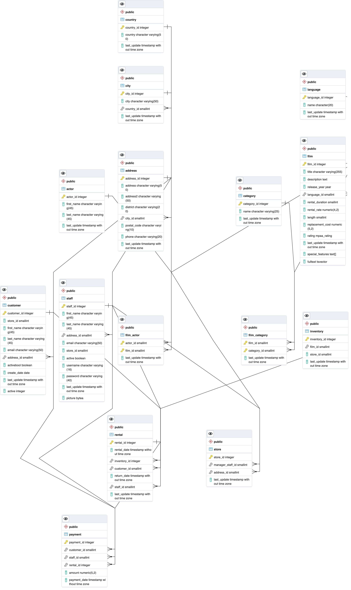

# vdm1-advanced-data-management

### Introduction

I am currently working on my Bachelors Degree in Computer Science at [WGU](https://www.wgu.edu/online-it-degrees/bachelors-programs.html) and this project is for the Advanced Data Managemnt coursei D191. 

## DVD Database

### Project Information

The goal of this project is to export data from our primary database into a new aggregation. We should be able to answer some real-world business questions from reports generated using our newly aggregated data. 

The real-world business question that we want to answer with our reports is what are our best performing titles every month. The detailed aggregate section will contain all rentals placed with their rental date and rental price. Through this data we will be able generate a monthly top 10 with sum totals for each film. 


## Describe The Dataset

We can dig into the SQL SHELL (psql) command line utility that comes bundled with the postgresql13 installation for [Mac](https://www.enterprisedb.com/downloads/postgres-postgresql-downloads) to see exactly what we are working with. This should be similar for any Windows or Linux install. 


# Let's log in. 

```bash
Server [localhost]: 
Database [postgres]: 
Port [5433]: 
Username [postgres]: 
Password for user postgres:********* 

psql (13.5)
Type "help" for help.

postgres=# 
``` 
# Now let's run some commands to get more info

```bash
postgres=# \l
                             List of databases
   Name    |  Owner   | Encoding | Collate | Ctype |   Access privileges   
-----------+----------+----------+---------+-------+-----------------------
 dvdrental | postgres | UTF8     | C       | C     | 
 postgres  | postgres | UTF8     | C       | C     | 
 template0 | postgres | UTF8     | C       | C     | =c/postgres          +
           |          |          |         |       | postgres=CTc/postgres
 template1 | postgres | UTF8     | C       | C     | =c/postgres          +
           |          |          |         |       | postgres=CTc/postgres
(4 rows)

postgres=# \c dvdrental
You are now connected to database "dvdrental" as user "postgres".
dvdrental=# \dt
             List of relations
 Schema |     Name      | Type  |  Owner   
--------+---------------+-------+----------
 public | actor         | table | postgres
 public | address       | table | postgres
 public | category      | table | postgres
 public | city          | table | postgres
 public | country       | table | postgres
 public | customer      | table | postgres
 public | film          | table | postgres
 public | film_actor    | table | postgres
 public | film_category | table | postgres
 public | inventory     | table | postgres
 public | language      | table | postgres
 public | payment       | table | postgres
 public | rental        | table | postgres
 public | staff         | table | postgres
 public | store         | table | postgres
(15 rows)

dvdrental=# 

```

As we can see the provided dataset includes customer information, film information, store information, etc. below is an ERD diagram with more detailed information which can be generated automatically from PgAdmin4. 

# ERD Diagram

Here is a detailed view of the dataset



# Real World Report

Now that we have enough information about our data, I have decided to create a summary report of the top 10 performing rentals of the month and if they are family friendly or not. This will be useful to the company, so that they can know what kind of inventory to keep in stock. To accomplish this report, I will need to combine data from the Payments, Inventory, Rental, and Film tables into a new table called all_rentals, this will be our detailed table. I will also createa another table called top_rentals which will take data from the detailed table and create our summary report. 

### Table Creation

Let's start by creating the new detailed and summary tables. The fields included are as shown below. 

```sql
CREATE TABLE IF NOT EXISTS all_rentals (
   title varchar(255),
   rating mpaa_rating,
   rental_rate numeric(4,2),
   rental_date TIMESTAMP
);

CREATE TABLE IF NOT EXISTS top_rentals (
   title varchar(255),
   family_friendly varchar(3),
   totals varchar(10)
);

```

### Transformation

As you can see we have a family_friendly field in our top_rentals table. This will be populated using a function to transfrom the ratings into a simple Yes or No family friendly value. Here is the plpgsql function below.

```sql
Create or replace function family_friendly (rating mpaa_rating)
returns varchar
Language plpgsql
as
$$
Declare
 friendly varchar;
	Begin
	
	 if rating = 'R' then
		 friendly := 'No';
	 elseif rating = 'NC-17' then
		 friendly := 'No';
	 else 
		 friendly := 'Yes';
	 end if;
	
	return friendly;
End;
$$;

```


### Populate all_rentals table


Next we can populate the all_rentls table

```sql


```

Now we will create our query to sum up the total rentals for each of our films. 

```sql
SELECT 
	film.title, sum(payment.amount) as total_rentals
FROM 
	rental
INNER JOIN inventory ON rental.inventory_id = inventory.inventory_id
INNER JOIN film ON film.film_id  = inventory.film_id
INNER JOIN payment ON rental.rental_id = payment.rental_id
group by film.film_id
order by total_rentals desc
limit 10;
```

